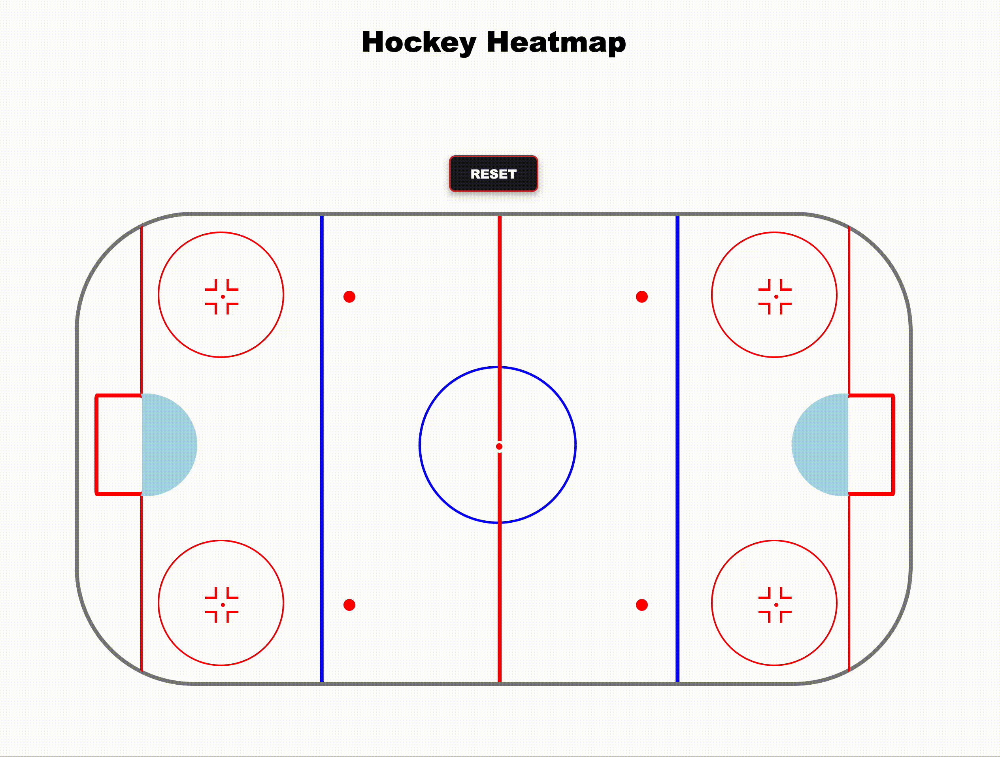

# Hockey Heatmap

A twist on [The Odin Project](https://www.theodinproject.com/)'s Etch-a-Sketch lesson. Users can click on the hockey rink to log shot attempts, with each click darkening the cell to visualize shot frequency.

## Live Demo

Check it out live [here on Netlify](https://hockeyheatmap.netlify.app).

## How It's Made:

**Tech Used:** HTML, CSS, JavaScript

The main focus of this project was creating and implementing the interactive heatmap with JavaScript. The HTML and CSS for the hockey rink were adapted from [this CodePen by Eric Wan](https://codepen.io/EricWan/pen/BaoBpJb).

## Optimizations

- [ ] Make it mobile responsive - ensure the rink and grid scale properly on smaller screens
- [ ] Add click-and-drag functionality to shade multiple cells continuously for faster heatmap shading.
- [ ] Use circular or hexagonal cells instead of rectangles for a more visually appealing heatmap.

## Lessons Learned:

I was unfamiliar with the dataset attribute before this project, and found it a convenient way to store the amount of clicks for each cell.

Overlaying the grid container over the hockey rink took some troubleshooting, especially getting the cells to fit the size of the rink. 
